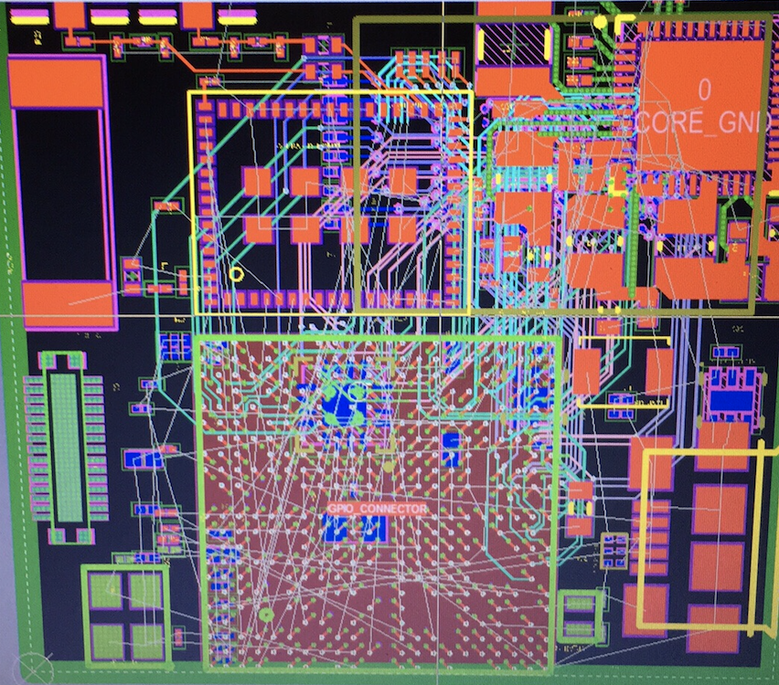

# MARK 1
A Linux embedded system based on Allwinner's H3 SOC. It provides a quad-core CPU, 2GB memory, wifi, bt and nfc with builtin antennas.

This project is not public yet, but will be in the future. Have a look in the schematic for more details. Here's a look at the progress so far...

